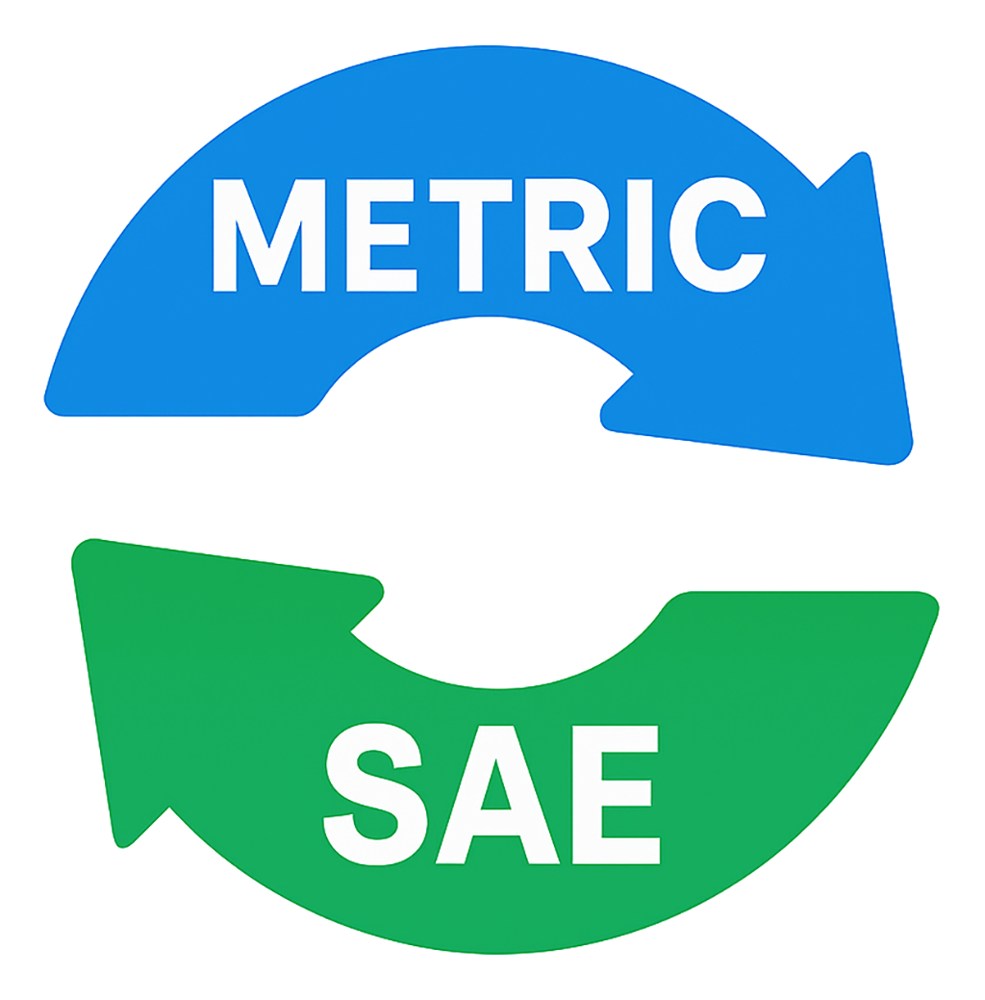

# Bimetric Inline Unit Converter

A Chrome extension that automatically converts between metric and imperial (SAE) units inline on web pages, making it easy to understand measurements in your preferred unit system.



## Features

- **Bidirectional Conversion**: Convert from metric to imperial or imperial to metric
- **Inline Display**: Conversions appear directly next to original values with highlighting
- **Comprehensive Unit Support**: 
  - **Length**: mm, cm, m, km ↔ in, ft, yd, mi
  - **Weight**: g, kg ↔ oz, lb  
  - **Volume**: ml, l ↔ fl oz, gal
  - **Temperature**: °C ↔ °F
  - **Acceleration**: m/s², m/s^2, m/s2 ↔ ft/s², ft/s^2, ft/s2
- **Smart Detection**: Recognizes various unit formats and abbreviations including:
  - Dimension patterns (e.g., "15.7 x 11.8 inch")  
  - Range patterns (e.g., "1-2mm", "5 - 10 ft")
  - Quote notation for feet/inches (e.g., 6'2" or Georgetown 63" lamp)
  - Acceleration patterns (e.g., "9.8 m/s²", Wikipedia-style "9.8 m/s<sup>2</sup>")
  - Smart unit scaling (1524mm → 152.4cm, 2000g → 2kg)
- **Enhanced Filtering**: 
  - Prevents false conversions of social media timestamps ("1m ago", "posted 5m")
  - Excludes time duration patterns ("for 1m 31s", "thought for 2m")
  - Excludes financial/statistical "M" representations ("$5M", "10M people")
  - Ignores text inside links to prevent URL conversion errors
  - Skips zero values for non-temperature units (0°C and 0°F still convert)
  - Prevents false temperature matches (e.g., "GPT-4o" is not parsed as "-4º")
- **Smart Temperature Detection**: 
  - Converts temperatures with just degree symbols (e.g., "80º") by assuming the scale based on conversion mode
  - When enabled, "80º" becomes "80º (80°C = 176°F)" in metric-to-imperial mode
  - When enabled, "80º" becomes "80º (80°F = 26.67°C)" in imperial-to-metric mode
- **Customizable Notifications**: 
  - 80% transparent notifications with backdrop blur
  - Adjustable duration (1-10 seconds)
  - Size options (Normal/Smaller)
- **Auto-conversion**: Automatically convert units when pages load (optional)
- **Easy Toggle**: Switch between conversion modes or turn off completely
- **Clean Reset**: Remove all conversions to restore original page content

## Installation

### From Chrome Web Store
*Coming soon - extension pending review*

### Manual Installation (Developer Mode)
1. Download or clone this repository
2. Open Chrome and navigate to `chrome://extensions/`
3. Enable "Developer mode" in the top right
4. Click "Load unpacked" and select the `src` folder
5. The extension icon will appear in your browser toolbar

## Usage

1. Click the Bimetric extension icon in your browser toolbar
2. Select your preferred conversion mode:
   - **Metric to Imperial**: Converts metric units to imperial equivalents
   - **Imperial to Metric**: Converts imperial units to metric equivalents  
   - **Off**: Disables conversion
3. **Optional**: Adjust settings by clicking "Settings":
   - **Auto-convert**: Automatically convert units when pages load
   - **Convert temperatures without explicit scale**: Assume temperature scale based on conversion mode for ambiguous temperatures (e.g., "80º")
   - **Notification duration**: Set how long conversion notifications appear (1-10 seconds)
   - **Notification size**: Choose between Normal and Smaller notification sizes
4. Click "Convert This Page" to apply conversions to the current webpage
5. Click "Reset Conversions" to remove all conversions and restore original content

### Example Conversions

**Metric to Imperial:**
- 100 km → 100 km *(62.14 mi)*
- 2.5 m → 2.5 m *(8.20 ft)*
- 152.4 cm → 152.4 cm *(5.00 ft)*
- 1524 mm → 152.4 cm *(5.00 ft)* *[smart scaling]*
- 15.7 x 11.8 inch → 15.7 x 11.8 inch *(398.78 x 299.72 mm)*
- 1-2mm → 1-2mm *(0.04 - 0.08 in)* *[range pattern]*
- 500 ml → 500 ml *(16.91 fl oz)*
- 25°C → 25°C *(77°F)*
- 0°C → 0°C *(32°F)* *[freezing point]*
- 80º → 80º *(80°C = 176°F)* *[ambiguous temperature - assumes Celsius]*
- 9.8 m/s² → 9.8 m/s² *(32.15 ft/s²)*

**Imperial to Metric:**
- 50 mph → 50 mph *(80.45 km/h)*
- 6 ft → 6 ft *(1.83 m)*  
- 6'2" → 6'2" *(187.96 cm)*
- Georgetown 63" lamp → Georgetown 63" *(160.02 cm)* lamp
- 40 x 30 cm → 40 x 30 cm *(15.75 x 11.81 in)*
- 5 - 10 ft → 5 - 10 ft *(1.52 - 3.05 m)* *[range pattern]*
- 1 gallon → 1 gallon *(3.79 l)*
- 72°F → 72°F *(22°C)*
- 0°F → 0°F *(-17.78°C)* *[absolute reference]*
- 80º → 80º *(80°F = 26.67°C)* *[ambiguous temperature - assumes Fahrenheit]*
- 32.2 ft/s² → 32.2 ft/s² *(9.82 m/s²)*

**Filtering Examples (NOT converted):**
- "Posted 5m ago" *(social media timestamp)*
- "Thought for 1m 31s" *(time duration)*
- "Company valued at $10M" *(financial context)*
- "GPT-4o model" *(false temperature match)*
- Links: [example.com/43Z0l](https://example.com/43Z0l) *(inside anchor tags)*
- "Distance: 0 km" *(zero value for non-temperature)*

## Supported Units

### Length/Distance
| Metric | Imperial |
|--------|----------|
| mm (millimeters) | in (inches) |
| cm (centimeters) | ft (feet) |
| m (meters) | yd (yards) |
| km (kilometers) | mi (miles) |

### Weight/Mass
| Metric | Imperial |
|--------|----------|
| g (grams) | oz (ounces) |
| kg (kilograms) | lb (pounds) |

### Volume
| Metric | Imperial |
|--------|----------|
| ml (milliliters) | fl oz (fluid ounces) |
| l (liters) | gal (gallons) |

### Temperature
| Metric | Imperial |
|--------|----------|
| °C (Celsius) | °F (Fahrenheit) |

### Acceleration
| Metric | Imperial |
|--------|----------|
| m/s² (meters per second squared) | ft/s² (feet per second squared) |

## Technical Details

### Architecture
- **Manifest V3**: Modern Chrome extension format
- **Content Scripts**: Processes webpage content for unit detection and conversion
- **Smart Pattern Recognition**: Handles both individual units and dimension patterns (e.g., "A x B units")
- **Quote Notation Support**: Recognizes ' (feet) and " (inches) in various contexts
- **Smart Unit Scaling**: Automatically scales to appropriate units (mm→cm, g→kg, etc.)
- **Overlap Prevention**: Prevents double conversion of dimension patterns
- **Storage Integration**: Persists user preferences and settings
- **Popup Interface**: Provides user controls and expandable settings panel
- **Advanced Filtering**: 
  - Excludes social media timestamps and financial contexts
  - Ignores content inside anchor tags (`<a>` elements)
  - Skips zero values for non-temperature measurements
  - Handles HTML split patterns for scientific notation

### Permissions
- `activeTab`: Access current webpage content for conversion
- `storage`: Save user preferences and conversion mode

## Development

### Project Structure
```
src/
├── manifest.json       # Extension configuration
├── content.js         # Main conversion logic and pattern recognition
├── popup.html         # Extension popup interface  
├── popup.js          # Popup functionality and settings management
├── popup-styles.css  # Popup styling
├── styles.css        # Content script styles and animations
└── icons/            # Extension icons
    ├── icon16.png
    ├── icon48.png
    └── icon128.png

tests/
├── README.md          # Testing documentation
├── test.html         # Test page with various unit measurements
└── debug-test.js     # Regex pattern testing script
```

### Building and Packaging

The project includes multiple build scripts for creating distribution packages:

### Quick Build Commands
```bash
# Build both ZIP and CRX files
./build.sh
# or
make build

# Build only ZIP file (for Chrome Web Store)
make build-zip

# Build only CRX file (for manual distribution)  
make build-crx

# Clean build artifacts
make clean
```

### Build Outputs
All builds create files in the `dist/` directory:
- **`bimetric-inline-converter-{version}.zip`** - For Chrome Web Store submission
- **`bimetric-inline-converter-{version}.crx`** - For manual installation/distribution

The version number is automatically extracted from `src/manifest.json`.

### Requirements
- **ZIP creation**: No additional requirements
- **CRX creation**: Requires Google Chrome/Chromium and private key (`keys/bimetric-inline-converter.pem`)
- **Node.js builds**: Requires Node.js 12+ (dependencies auto-install)

For detailed build instructions, see [BUILD.md](BUILD.md).

### Testing
1. Load the extension in developer mode
2. Open `tests/test.html` in Chrome to test various unit measurements
3. Use the extension popup to test different conversion modes
4. Run `node tests/debug-test.js` to verify regex patterns work correctly
5. Verify conversions are accurate and properly formatted

For detailed testing information, see the [tests/README.md](tests/README.md) file.

## Privacy

This extension:
- ✅ Works entirely locally - no data sent to external servers
- ✅ Only accesses webpage content when conversion is requested
- ✅ Stores only user preferences locally in Chrome storage
- ✅ No tracking, analytics, or data collection

## Contributing

Contributions are welcome! Please feel free to submit issues or pull requests.

### Ideas for Enhancement
- Additional unit types (area, speed, pressure, etc.)
- Customizable conversion precision
- Keyboard shortcuts
- Automatic conversion mode based on page content
- Support for more unit formats and abbreviations

## License

MIT License - see LICENSE file for details

## Version History

### v1.4.0 (Upcoming)
- **Range Pattern Support**: Added intelligent recognition of range patterns
  - Supports both "1-2mm" and "1 - 2mm" formats
  - Converts ranges like "about 1-2mm higher" → "about 1-2mm *(0.04 - 0.08 in)* higher"
  - Works with all supported units (metric and imperial)
- **Enhanced Time Duration Filtering**: Improved filtering to prevent false conversions
  - Added filtering for "for Xm" patterns (e.g., "thought for 1m")
  - Added filtering for "Xm Xs" minute-second patterns (e.g., "1m 31s duration")
  - Excludes zero values appropriately ("for 0m" ignored, "0m 30s" allowed)
- **Improved Ambiguous Temperature Detection**: Enhanced pattern matching for temperature symbols
  - Requires space or line start before numbers to prevent false matches
  - Fixes issue where "GPT-4o" was incorrectly parsed as "-4º"
  - Pattern: `(?:^|\s)(-?\d*\.?\d+)\s*[ºo°](?!\w)` ensures proper context
- **Comprehensive Test Coverage**: Added extensive test cases for new filtering patterns

### v1.3.2
- **Bug Fixes**: Fixed regex pattern matching for Unicode degree symbols
  - Replaced word boundary `\b` with negative lookahead `(?!\w)` to properly handle Unicode characters
  - Resolved issues with degree symbol detection in various contexts
- **Code Cleanup**: Removed debug logging from production code
- **Project Reorganization**: Moved test files to dedicated `tests/` folder with comprehensive documentation

### v1.3.1
- **UI Improvements**: Fixed toggle switch alignment and label text
- **Testing**: Added comprehensive test cases for ambiguous temperature conversion

### v1.3.0
- **Smart Temperature Detection**: Added support for ambiguous temperatures with just degree symbols
  - New setting: "Convert temperatures without explicit scale" (enabled by default)
  - "80º" now converts to "80º (80°C = 176°F)" in metric-to-imperial mode
  - "80º" now converts to "80º (80°F = 26.67°C)" in imperial-to-metric mode
  - Works with various degree symbols: º, °, o
  - Smart pattern matching prevents conversion when followed by explicit C/F
- **Enhanced User Interface**: Added toggle switch for the new temperature conversion setting
- **Improved Pattern Recognition**: More precise temperature pattern matching to avoid conflicts

### v1.2.1
- **Permission Optimization**: Removed unused `scripting` permission for Chrome Web Store compliance
- **Minimal Permissions**: Now only requests essential permissions (`storage`, `activeTab`)
- **Improved Security**: Reduces extension attack surface by removing unnecessary permissions
- **Enhanced Filtering**: Added intelligent filtering to prevent false positive conversions
  - Social media timestamps (e.g., "1m ago", "posted 5m") are now excluded from conversion
  - Financial/statistical "M" representations (e.g., "$5M", "10M people") are properly handled
  - Text inside links (`<a>` tags) is excluded to prevent URL conversion errors
  - Zero values are skipped for non-temperature units (0°C and 0°F still convert properly)
- **Acceleration Conversions**: Added support for acceleration units (m/s², ft/s²)
  - Handles multiple formats: m/s², m/s^2, m/s2, ft/s², ft/s^2, ft/s2
  - Supports Wikipedia-style HTML patterns: "9.8 m/s<sup>2</sup>"
- **Bug Fixes**: 
  - Fixed HTML split pattern spacing issues
  - Improved conversion accuracy for edge cases

### v1.2.0
- **Quote Mark Support**: Added recognition for ' (feet) and " (inches) notation
- **Smart Unit Scaling**: Automatic scaling to appropriate units (1524mm → 152.4cm, 2000g → 2kg)
- **Enhanced Pattern Recognition**: Better handling of mixed quote/unit contexts
- **Improved Conversion Logic**: More accurate dimension pattern processing

### v1.1.0
- **Enhanced Notifications**: 80% transparent notifications with backdrop blur
- **Customizable Settings**: Duration (1-10 seconds) and size (Normal/Smaller) options  
- **Dimension Pattern Support**: Smart recognition of patterns like "15.7 x 11.8 inch"
- **Double Conversion Fix**: Prevents dimension patterns from being converted twice
- **Auto-conversion**: Optional automatic conversion when pages load
- **Expandable Settings Panel**: Collapsible settings in popup interface

### v1.0.0
- Initial release
- Basic metric ↔ imperial conversion
- Support for length, weight, volume, and temperature
- Inline conversion display with highlighting
- User-selectable conversion modes

---

**Made with ❤️ for the global community who deals with mixed unit systems daily**
